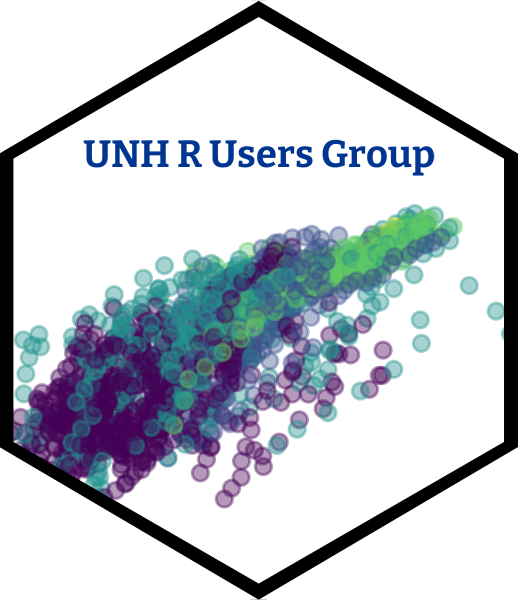

<style type="text/css">
.title {
  display: none;
}

#getting-started img {
  margin-right: 10px;
}

</style>

<div class="row" style="padding-top: 30px;">
<div class="col-sm-6">

# **Welcome!**

Welcome to the UNH R Users Group! We're a community of R users at the University of New Hampshire dedicated to supporting one another in using coding software for research, education, and for fun! All experience levels are encouraged. Join us for open collaboration, mutual assistance and learning more about R.

```{r, results='asis', echo=FALSE}
library(knitr)

# Example schedule data frame
schedule <- data.frame(
  Time = c("9:00 - 10:00", "10:00 - 11:00", "11:00 - 12:00"),
  Monday = c("Math", "Science", "History"),
  Tuesday = c("English", "Math", "Science"),
  Wednesday = c("Science", "English", "Math"),
  Thursday = c("Math", "Science", "English"),
  Friday = c("History", "Math", "Science")
)

# Print the schedule table
kable(schedule, format = "markdown")

```

</div>
<div class="col-sm-6">


{width=200px style="margin-left: 100px;"}


</a>
</div>
